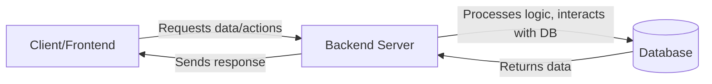
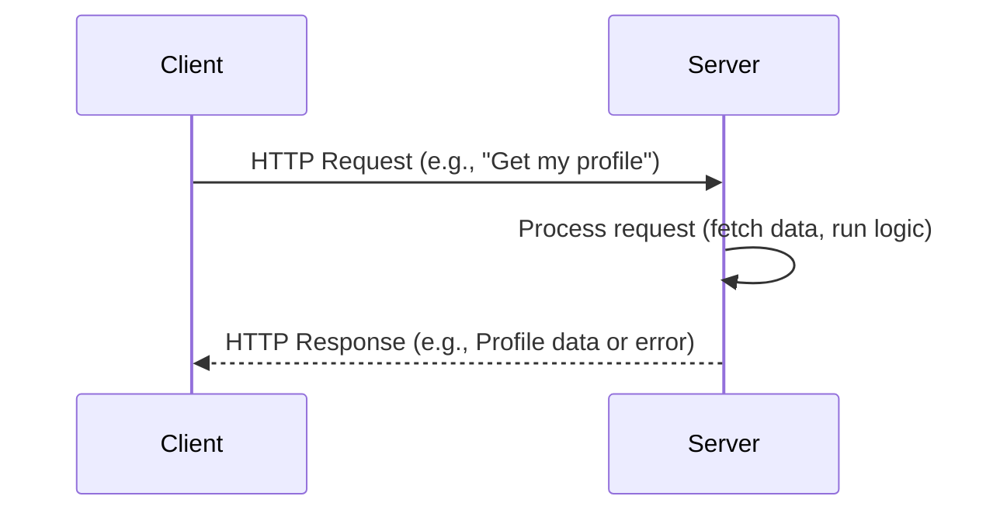
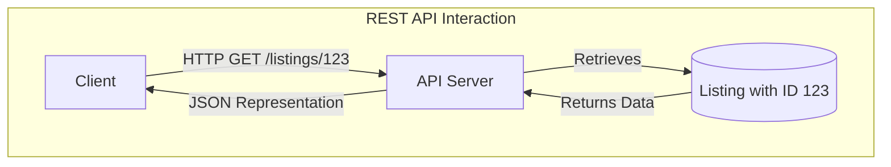
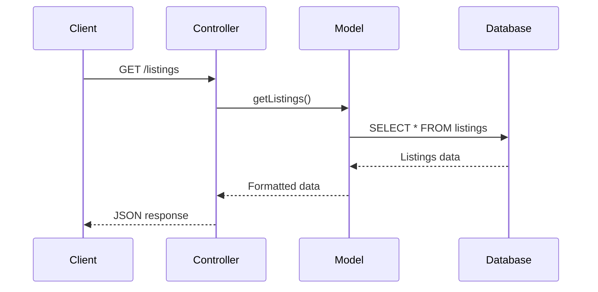

# Backend Development: Preliminary Concepts & Weekly Guide Notes

Welcome to your backend development journey! Before we dive into building the Campus Marketplace API week by week, let's cover some fundamental concepts that will form the bedrock of your understanding.

---

## Part 1: Essential Preliminary Information

### 1. What is Backend Development?

Backend development refers to the server-side of an application. It's the engine under the hood that you don't see but that powers everything the user interacts with on the frontend (the website or mobile app).

- **Responsibilities:**
  - Storing and organizing data (e.g., user profiles, product listings).
  - Handling the application's logic (e.g., processing an order, authenticating a user).
  - Creating APIs (Application Programming Interfaces) for the frontend to communicate with.
  - Ensuring security and performance.



### 2. Client-Server Architecture

Most web applications follow a client-server model.

- **Client:** The user's device and software (e.g., web browser, mobile app). It's responsible for the user interface and initiating requests.
- **Server:** A powerful computer or system that stores data, runs application logic, and responds to client requests.



### 3. HTTP (HyperText Transfer Protocol)

HTTP is the protocol used for communication between clients and servers on the web.

- **Request Methods (Verbs):** Indicate the desired action to be performed on a resource.
  - `GET`: Retrieve data (e.g., get a user's profile). Safe and idempotent.
  - `POST`: Submit data to create a new resource (e.g., register a new user).
  - `PUT`: Update an existing resource completely. Idempotent.
  - `PATCH`: Partially update an existing resource.
  - `DELETE`: Remove a resource. Idempotent.
- **Status Codes:** Indicate the result of an HTTP request.
  - `2xx` (Successful): e.g., `200 OK`, `201 Created`, `204 No Content`.
  - `3xx` (Redirection): e.g., `301 Moved Permanently`.
  - `4xx` (Client Errors): e.g., `400 Bad Request`, `401 Unauthorized`, `403 Forbidden`, `404 Not Found`.
  - `5xx` (Server Errors): e.g., `500 Internal Server Error`.

### 4. What is an API (Application Programming Interface)?

An API is a set of rules and protocols that allows different software applications to communicate with each other. In web development, it often refers to how the frontend talks to the backend.

- **Contract:** Defines how requests should be made and what responses can be expected.

### 5. RESTful APIs

REST (Representational State Transfer) is an architectural style for designing networked applications, particularly web services. APIs designed according to REST principles are called RESTful APIs.

- **Key Principles:**
  1.  **Client-Server:** Separation of concerns between client and server.
  2.  **Statelessness:** Each request from a client to a server **must** contain all the information needed to understand the request. The server does not store any client context between requests.
  3.  **Cacheability:** Responses can be marked as cacheable or non-cacheable to improve performance.
  4.  **Uniform Interface:** This is a key constraint and simplifies the architecture. It includes:
      - **Resource Identification (URIs):** Resources are identified by URIs (e.g., `/users`, `/listings/123`).
      - **Resource Manipulation Through Representations:** Clients interact with resources via their representations (commonly JSON or XML).
      - **Self-Descriptive Messages:** Requests and responses contain enough information to describe how to process them.
      - **Hypermedia as the Engine of Application State (HATEOAS):** (Optional but good practice) Responses can include links to related actions/resources.
  5.  **Layered System:** Intermediary servers (e.g., load balancers, caches) can be placed between the client and the server without the client knowing.
- **Focus on Resources:** REST APIs are designed around _resources_ (e.g., users, listings, comments). You perform actions on these resources using HTTP methods.



### 6. MVC (Model-View-Controller) Architecture

MVC is a popular architectural pattern for organizing code in applications, promoting separation of concerns.

- **Model:**
  - Manages the application's data, logic, and rules.
  - Interacts directly with the database.
  - Example: A `User` model might have functions to fetch user data, update user details, or validate user input.
- **View:**
  - Responsible for presenting data to the user (the UI).
  - In the context of a REST API, the "view" is often the JSON (or other format) representation of the resource sent in the HTTP response.
- **Controller:**
  - Acts as an intermediary between the Model and the View (or the client request and the model in an API).
  - Receives client requests, processes them (by interacting with the Model), and then determines what response to send back.
  - Example: A `ListingsController` might handle requests for `/listings`, use the `ListingModel` to fetch data, and then format the response.



- **Benefits:**
  - **Separation of Concerns:** Makes code easier to manage, understand, and test.
  - **Reusability:** Models and sometimes controllers can be reused.
  - **Maintainability:** Changes in one part are less likely to break others.

### 7. Databases Overview

Databases are systems for storing, managing, and retrieving data efficiently.

- **SQL (Relational Databases):**
  - Data is stored in tables with predefined schemas (rows and columns).
  - Relationships are defined between tables (e.g., PostgreSQL, MySQL).
- **NoSQL (Non-Relational Databases):**
  - More flexible data models. Several types exist:
    - **Document Databases (like MongoDB):** Store data in document-like structures (e.g., JSON/BSON). This is what we'll be using.
    - Key-Value Stores, Column-Family Stores, Graph Databases.
- **Data Modeling:** The process of designing how your data will be structured in the database.

### 8. JSON (JavaScript Object Notation)

JSON is a lightweight, human-readable data interchange format. It's widely used in APIs to send and receive data.

- **Structure:** Consists of key-value pairs (like JavaScript objects) and ordered lists (like JavaScript arrays).
  ```json
  {
    "name": "Used Textbook",
    "price": 29.99,
    "tags": ["calculus", "math", "used"]
  }
  ```

---

## Part 2: Weekly Key Notes for "Campus Marketplace API"

These notes provide a high-level overview of what to expect each week. They highlight the core goals, key concepts you should grasp, and the practical elements we'll be building.

### Week 1: Listings First (No User Association)

- **Core Goal:** Understand and implement fundamental CRUD (Create, Read, Update, Delete) operations. Set up a basic Express.js server.
- **Key Concepts to Understand Before We Start:**
  - HTTP Methods: `POST`, `GET`, `PUT`, `DELETE` and their purpose.
  - Express.js: What it is, basic routing (`app.get()`, `app.post()`, etc.).
  - Request (`req`) and Response (`res`) objects in Express.
  - Basic data validation (e.g., ensuring a price is a number).
  - What an API endpoint is.
- **Practical Focus / What We'll Be Building:**

  - **API Endpoints:**
    - `POST /listings` – Create a new listing.
    - `GET /listings` – Get all active listings.
    - `GET /listings/:id` – Get a single listing by ID.
    - `PUT /listings/:id` – Update a listing.
    - `DELETE /listings/:id` – Delete a listing.

  ```mermaid
  sequenceDiagram
      participant Client
      participant ExpressServer as API Server
      participant InMemoryData as (In-Memory Listings Array)

      Client->>ExpressServer: POST /listings (with listing data)
      ExpressServer->>ExpressServer: Validate data
      ExpressServer->>InMemoryData: Add new listing
      InMemoryData-->>ExpressServer: Confirm addition
      ExpressServer-->>Client: 201 Created (with new listing)

      Client->>ExpressServer: GET /listings/:id
      ExpressServer->>InMemoryData: Fetch listing by ID
      InMemoryData-->>ExpressServer: Return specific listing
      ExpressServer-->>Client: 200 OK (with listing data)
  ```

- **Why this is important:** CRUD operations are the backbone of most web applications. Mastering them is essential. This week lays the groundwork for all subsequent features.

### Week 2: User Model & Profiles

- **Core Goal:** Introduce user identity management and the concept of 1:1 data relationships.
- **Key Concepts to Understand Before We Start:**
  - Data Modeling: How to structure `User` and `Profile` data.
  - Password Hashing: Why it's critical to _never_ store plain text passwords (we'll use `bcrypt`).
  - Unique constraints (e.g., unique email addresses).
  - Designing API endpoints for user registration and profile management.
  - 1:1 Relationship: How a `User` can have one `Profile`, and a `Profile` belongs to one `User`.
- **Practical Focus / What We'll Be Building:**

  - **API Endpoints:**
    - `POST /auth/register` – Register a new user (creates `User` and associated `Profile`).
    - `GET /users/:id` – Get user details (should include profile information).
    - `PUT /users/:id/profile` – Update a user's profile.

  ```mermaid
  sequenceDiagram
      participant Client
      participant ExpressServer as API Server
      participant Database

      Client->>ExpressServer: POST /auth/register (email, password, campus)
      ExpressServer->>ExpressServer: Validate input (email format, password strength)
      ExpressServer->>ExpressServer: Hash password (bcrypt)
      ExpressServer->>Database: Create User record (email, passwordHash, role)
      Database-->>ExpressServer: User created (returns userId)
      ExpressServer->>Database: Create Profile record (userId, campus, bio, avatar)
      Database-->>ExpressServer: Profile created
      ExpressServer-->>Client: 201 Created (User and Profile info)
  ```

- **Why this is important:** Almost every application needs to manage users. Understanding how to model user data securely and create related profiles is a core skill.

### Week 3: Link Listings to Users (1:M Ownership)

- **Core Goal:** Establish ownership of listings by users, introducing 1:M (one-to-many) relationships.
- **Key Concepts to Understand Before We Start:**
  - 1:M Relationship: How one `User` can own many `Listings`, but each `Listing` belongs to only one `User`.
  - Foreign Keys: How we link related data (e.g., storing `sellerId` in the `Listing` model).
  - Data Integrity: Ensuring that `sellerId` refers to an actual user.
  - Designing API endpoints that reflect data ownership.
- **Practical Focus / What We'll Be Building:**

  - **API Endpoints (Modifications & New):**
    - Modify `POST /listings` – To require and store `sellerId`.
    - Modify `PUT /listings/:id` – Prepare for ownership checks.
    - Modify `DELETE /listings/:id` – Prepare for ownership checks.
    - `GET /users/:id/listings` – Get all listings created by a specific user.

  ```mermaid
  sequenceDiagram
      participant Client
      participant ExpressServer as API Server
      participant Database

      Client->>ExpressServer: POST /listings (listing data, sellerId)
      ExpressServer->>ExpressServer: Validate data
      ExpressServer->>Database: Create Listing record (with sellerId)
      Database-->>ExpressServer: Listing created
      ExpressServer-->>Client: 201 Created (with new listing)

      Client->>ExpressServer: GET /users/user123/listings
      ExpressServer->>Database: Fetch listings where sellerId = 'user123'
      Database-->>ExpressServer: Return user's listings
      ExpressServer-->>Client: 200 OK (with listings data)
  ```

- **Why this is important:** Real-world applications involve complex relationships between data. Understanding 1:M relationships is crucial for building features like "my posts," "my orders," etc.

### Week 4: Authentication & Authorization 🔐

- **Core Goal:** Secure the API by implementing user authentication (verifying who a user is) and basic authorization (determining what an authenticated user is allowed to do).
- **Key Concepts to Understand Before We Start:**
  - Authentication vs. Authorization.
  - JSON Web Tokens (JWT): What they are, their structure, and how they enable stateless authentication.
  - Access Tokens vs. Refresh Tokens.
  - Middleware in Express: How it can be used to protect routes and check permissions.
  - Role-Based Access Control (RBAC): Basic concepts.
- **Practical Focus / What We'll Be Building:**

  - **API Endpoints (New & Secured):**
    - `POST /auth/login` – Authenticate user, return JWTs.
    - `POST /auth/refresh` – Obtain a new access token.
    - Secure `POST /listings` (sellerId from authenticated user).
    - Secure `PUT /listings/:id` (owner only).
    - Secure `DELETE /listings/:id` (owner or admin only).
    - Secure `PUT /users/:id/profile` (self or admin).

  ```mermaid
  sequenceDiagram
      participant Client
      participant APIServer as API Server
      participant AuthMiddleware as JWT Middleware
      participant Database

      Client->>APIServer: POST /auth/login (email, password)
      APIServer->>Database: Verify credentials
      Database-->>APIServer: User valid / invalid
      alt User Valid
          APIServer->>APIServer: Generate JWT (Access & Refresh)
          APIServer-->>Client: Return JWTs
      else User Invalid
          APIServer-->>Client: 401 Unauthorized
      end

      Client->>APIServer: PUT /listings/abc (with JWT in Header, updateData)
      APIServer->>AuthMiddleware: Validate JWT
      AuthMiddleware->>AuthMiddleware: Check signature, expiry
      alt JWT Valid
          AuthMiddleware->>APIServer: Attach user info (req.user = {id, role})
          APIServer->>Database: Fetch listing 'abc' to check owner
          Database-->>APIServer: Listing details (including sellerId)
          APIServer->>APIServer: Check if req.user.id == listing.sellerId OR req.user.role == 'admin'
          alt Authorized
               APIServer->>Database: Update listing 'abc' with updateData
               Database-->>APIServer: Success
               APIServer-->>Client: 200 OK
          else Not Authorized
               APIServer-->>Client: 403 Forbidden
          end
      else JWT Invalid
          AuthMiddleware-->>Client: 401 Unauthorized
      end
  ```

- **Why this is important:** Security is paramount. Protecting user data and controlling access to resources is a fundamental responsibility of a backend developer.

### Week 5: Favorites System (M:M) ❤️

- **Core Goal:** Implement a many-to-many (M:M) relationship, allowing users to "favorite" multiple listings, and listings to be favorited by multiple users.
- **Key Concepts to Understand Before We Start:**
  - M:M Relationship: How to model it (often using a "junction" table/collection).
  - Designing API endpoints for creating and managing these M:M associations.
- **Practical Focus / What We'll Be Building:**

  - **API Endpoints:**
    - `POST /listings/:id/favorite` – Authenticated user favorites a listing.
    - `DELETE /listings/:id/favorite` – Authenticated user unfavorites a listing.
    - `GET /users/:id/favorites` – List all listings favorited by a specific user.

  ```mermaid
  sequenceDiagram
      participant Client
      participant APIServer as API Server (with AuthMiddleware)
      participant Database

      Client->>APIServer: POST /listings/xyz/favorite (with JWT)
      APIServer->>APIServer: (AuthMiddleware validates JWT, req.user available)
      APIServer->>Database: Create Favorite record (userId=req.user.id, listingId='xyz')
      alt Favorite already exists or error
          Database-->>APIServer: Error / Already Exists
          APIServer-->>Client: Appropriate Error (e.g., 409 Conflict or 200 OK if toggle)
      else Favorite created successfully
          Database-->>APIServer: Confirm creation
          APIServer-->>Client: 201 Created (or 200 OK)
      end

      Client->>APIServer: GET /users/user123/favorites (with JWT)
      APIServer->>APIServer: (AuthMiddleware validates JWT)
      APIServer->>Database: Fetch Favorite records for userId='user123'
      Database-->>APIServer: List of listingIds
      APIServer->>Database: Fetch details for each listingId
      Database-->>APIServer: Full favorited listings data
      APIServer-->>Client: 200 OK (with favorited listings)
  ```

- **Why this is important:** M:M relationships are common in features like tagging, social connections, user roles/permissions, and, of course, favorites or wishlists.

### Week 6: Real-World Polish & Advanced Features 🚀

- **Core Goal:** Enhance the API with features typically found in production applications, making it more robust and user-friendly.
- **Key Concepts to Understand Before We Start:**
  - File Uploads: Handling `multipart/form-data`, using libraries like `multer`.
  - Storing files (e.g., S3, local storage for dev).
  - API Query Parameters: For searching, filtering, sorting, and pagination.
  - Rate Limiting: Protecting your API from abuse.
  - Environment Variables: Managing configuration securely.
- **Practical Focus / What We'll Be Building:**

  - **API Endpoints (New & Enhanced):**
    - `POST /listings/:id/images` – Upload images for a listing.
    - Modify `GET /listings` to support:
      - Search (e.g., `?search=textbook`)
      - Filtering (e.g., `?category=books&minPrice=20`)
      - Sorting (e.g., `?sort=-createdAt`)
      - Pagination (e.g., `?page=1&limit=20`)

  ```mermaid
  sequenceDiagram
      participant Client
      participant APIServer as API Server (with AuthMiddleware)
      participant FileStorage as (e.g., S3 or Local Disk)
      participant Database

      Client->>APIServer: POST /listings/xyz/images (with JWT, image file)
      APIServer->>APIServer: (AuthMiddleware validates JWT, checks ownership of listing 'xyz')
      APIServer->>APIServer: Process image file (multer: validate type, size)
      APIServer->>FileStorage: Upload image
      FileStorage-->>APIServer: Image URL or path
      APIServer->>Database: Update Listing 'xyz' with image URL
      Database-->>APIServer: Confirm update
      APIServer-->>Client: 200 OK (with updated listing/image info)

      Client->>APIServer: GET /listings?search=cool&category=electronics&page=2
      APIServer->>Database: Construct query (search 'cool' in title/desc, category 'electronics', skip first 20, limit 20)
      Database-->>APIServer: Paginated and filtered listings
      APIServer-->>Client: 200 OK (with listings data and pagination info)
  ```

- **Why this is important:** These features transform a basic API into a more professional and usable service. They address scalability, performance, security, and user experience concerns.

---

This document should serve as a good starting point and a reference as we progress. Don't hesitate to ask questions! Let's build something great.
