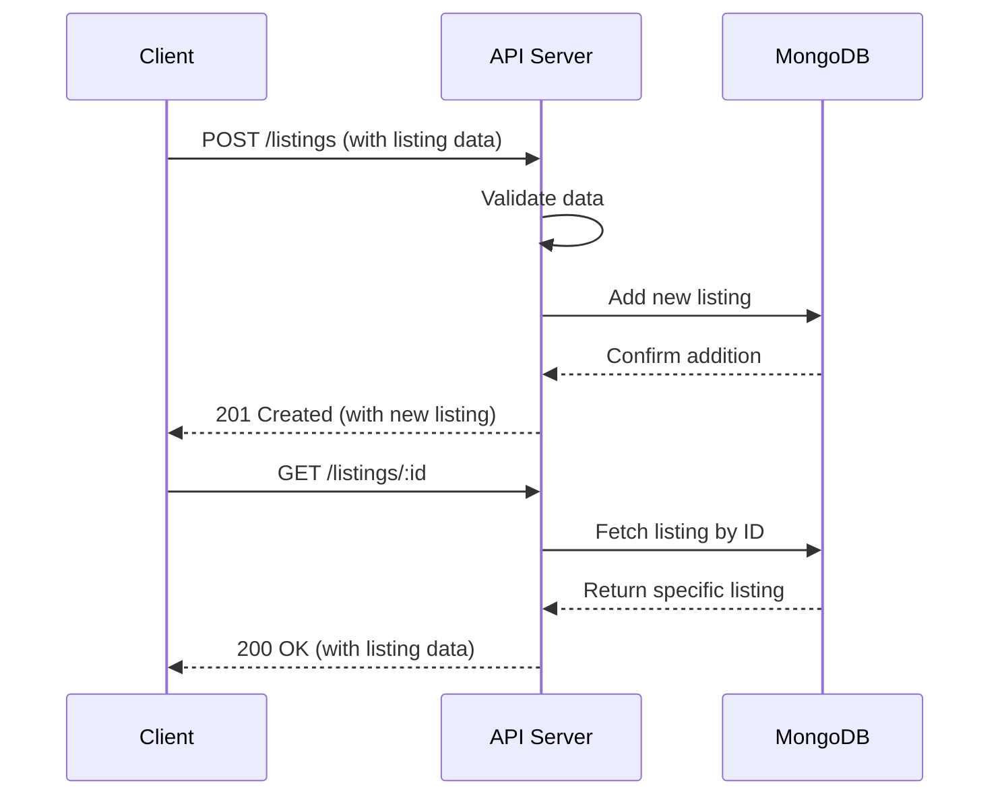

## 28-05-2025

**Core Goal:** Understand and implement fundamental CRUD (Create, Read, Update, Delete) operations. Set up a basic Express.js server.

**Key Concepts to Understand Before We Start:**

- HTTP Methods: `POST`, `GET`, `PUT`, `DELETE` and their purpose.
- Express.js: What it is, basic routing (`app.get()`, `app.post()`, etc.).
- Request (`req`) and Response (`res`) objects in Express.
- Basic data validation (e.g., ensuring a price is a number).
- What an API endpoint is.

**Practical Focus / What We'll Be Building:**

- **API Endpoints:**
  - `POST /listings` – Create a new listing.
  - `GET /listings` – Get all active listings.
  - `GET /listings/:id` – Get a single listing by ID.
  - `PUT /listings/:id` – Update a listing.
  - `DELETE /listings/:id` – Delete a listing.

**Why this is important:** CRUD operations are the backbone of most web applications. Mastering them is essential. This week lays the groundwork for all subsequent features.

---

## 21-05-2025

### Class Exercise

- [x] `GET /flashcards` - Get all flashcards
- [x] `GET /flashcard/:id` - Get flashcard by ID
- [x] `POST /flashcards` - Add new flashcard

---

### Assignment

**Create the following endpoints:**

- [ ] `DELETE /flashcard/:id` – Delete a flashcard by ID
- [ ] `GET /flashcards/random` – Get a random flashcard

---

#### Learn more

- [Git with Mosh](https://youtu.be/8JJ101D3knE?si=enCCqAApI_a8PMBx)
- [Express Documentation](https://expressjs.com/)
- [What is NPM](https://youtu.be/4BgY3aPcHd0?si=um7_XX6wRJvigPAs)
